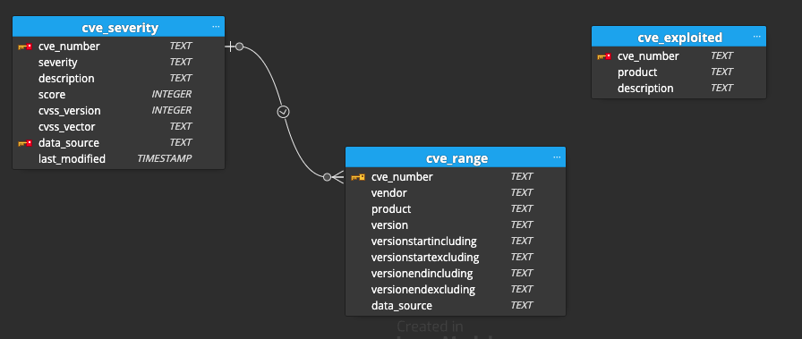
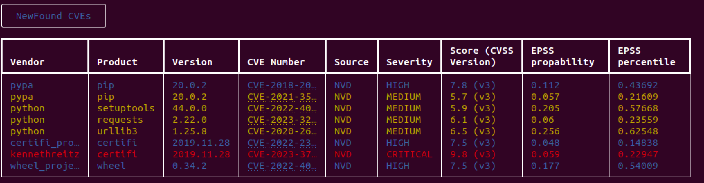
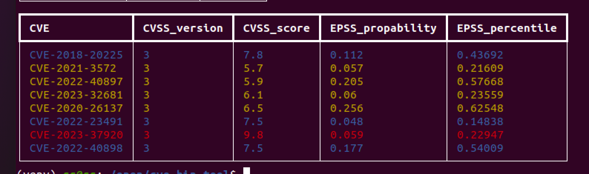
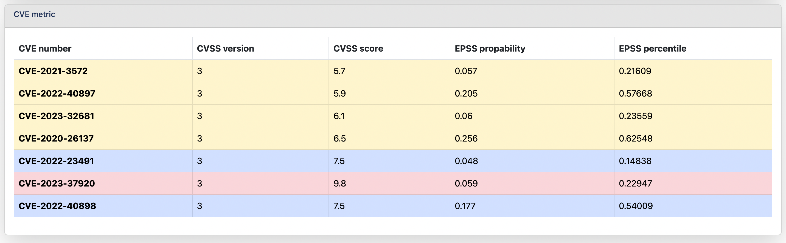
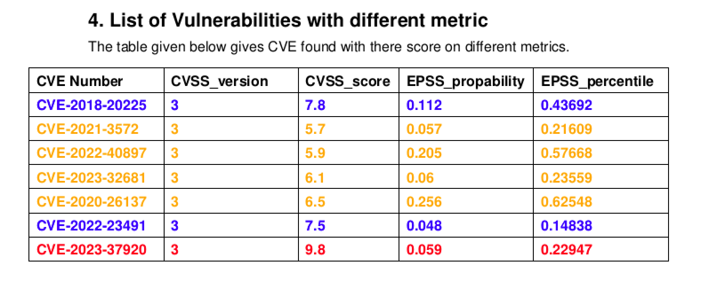
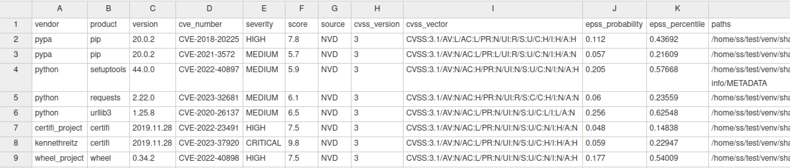
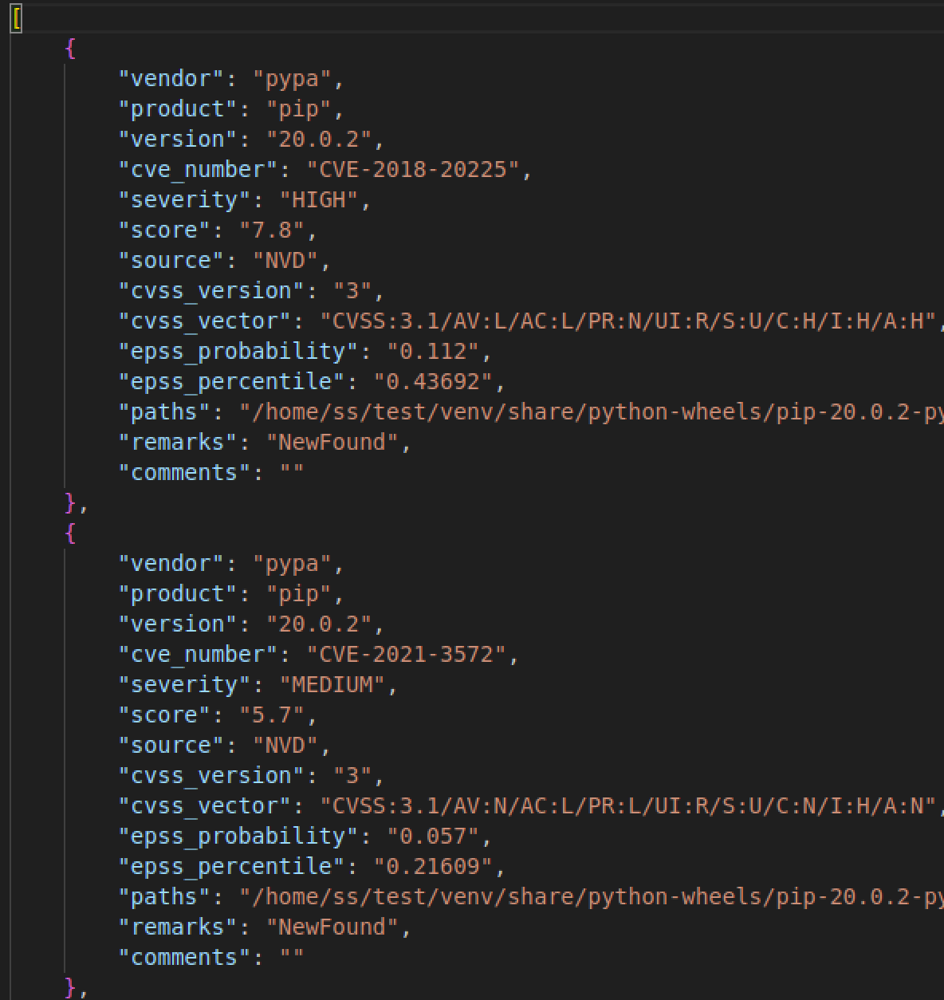
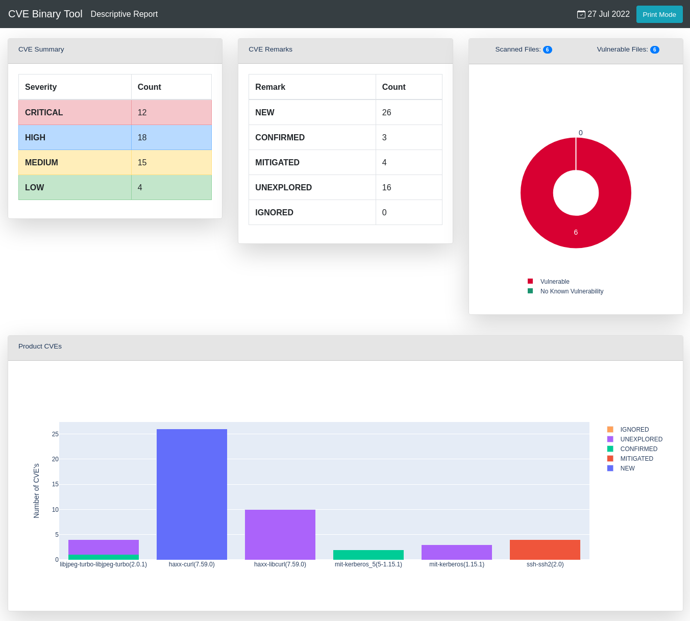
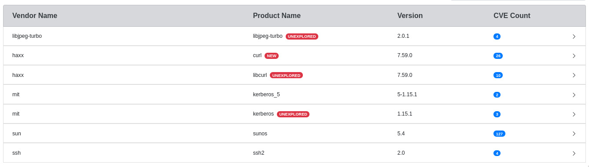
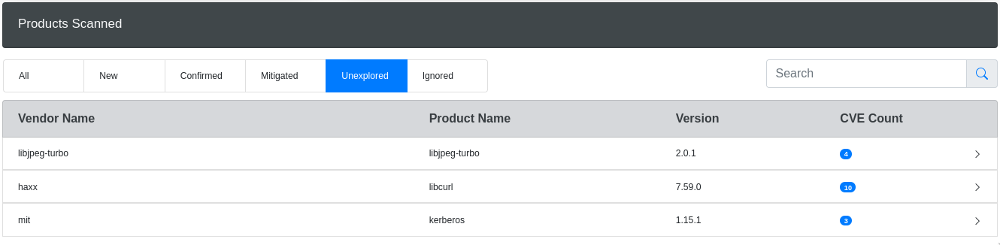

# CVE Binary Tool User Manual

- [CVE Binary Tool User Manual](#cve-binary-tool-user-manual)
  - [How it works](#how-it-works)
  - [Installing](#installing)
  - [Deployment best practices](#deployment-best-practices)
    - [Use user-level permissions with appropriate file system access](#use-user-level-permissions-with-appropriate-file-system-access)
    - [Use restrictions on system temp files](#use-restrictions-on-system-temp-files)
    - [Schedule data updates separately when running parallel scans](#schedule-data-updates-separately-when-running-parallel-scans)
    - [Using cve-bin-tool within a throwaway environment](#using-cve-bin-tool-within-a-throwaway-environment)
    - [Don't scan arbitrary binary files without additional sandboxing](#dont-scan-arbitrary-binary-files-without-additional-sandboxing)
  - [Fixing Known Issues / What should I do if it finds something?](#fixing-known-issues--what-should-i-do-if-it-finds-something)
  - [Data Sources](#data-sources)
    - [National Vulnerability Database (NVD)](#national-vulnerability-database-nvd)
    - [Open Source Vulnerability Database (OSV)](#open-source-vulnerability-database-osv)
    - [Gitlab Advisory Database (GAD)](#gitlab-advisory-database-gad)
    - [RedHat Security Database (REDHAT)](#redhat-security-database-redhat)
    - [Curl Database (Curl)](#curl-database-curl)
  - [Limitations](#limitations)
  - [Architecture](#architecture)
    - [Database Structure](#database-structure)
  - [Metric](#metric)
    - [EPSS](#epss)
    - [Different output showing metrics](#different-output-showing-metrics)
  - [Optional Arguments](#optional-arguments)
    - [-e EXCLUDE, --exclude EXCLUDE](#-e-exclude---exclude-exclude)
    - [-h, --help](#-h---help)
    - [-V, --version](#-v---version)
    - [--disable-version-check](#--disable-version-check)
    - [--disable-validation-check](#--disable-validation-check)
    - [--offline](#--offline)
  - [CVE Data Download Arguments](#cve-data-download-arguments)
    - [-u {now,daily,never,latest}, --update {now,daily,never,latest}](#-u-nowdailyneverlatest---update-nowdailyneverlatest)
    - [-n {json-nvd,json-mirror,api,api2}, --nvd {json-nvd,json-mirror,api,api2}](#-n-json-nvdjson-mirrorapiapi2---nvd-json-nvdjson-mirrorapiapi2)
    - [--nvd-api-key NVD\_API\_KEY](#--nvd-api-key-nvd_api_key)
    - [-d {NVD,OSV,GAD,CURL} \[{NVD,OSV,GAD,CURL} ...\], --disable-data-source {NVD,OSV,GAD,CURL} \[{NVD,OSV,GAD,CURL} ...\]](#-d-nvdosvgadcurl-nvdosvgadcurl----disable-data-source-nvdosvgadcurl-nvdosvgadcurl-)
  - [Checkers Arguments](#checkers-arguments)
    - [-s SKIPS, --skips SKIPS](#-s-skips---skips-skips)
    - [-r CHECKERS, --runs CHECKERS](#-r-checkers---runs-checkers)
  - [Input Arguments](#input-arguments)
    - [directory (positional argument)](#directory-positional-argument)
    - [-i INPUT\_FILE, --input-file INPUT\_FILE](#-i-input_file---input-file-input_file)
    - [--sbom-file SBOM\_FILE](#--sbom-file-sbom_file)
    - [--vex-file VEX\_FILE](#--vex-file-vex_file)
    - [-L PACKAGE\_LIST, --package-list PACKAGE\_LIST](#-l-package_list---package-list-package_list)
    - [-C CONFIG, --config CONFIG](#-c-config---config-config)
      - [Yaml example file](#yaml-example-file)
      - [Toml example file](#toml-example-file)
  - [Output Arguments](#output-arguments)
    - [-o OUTPUT\_FILE, --output-file OUTPUT\_FILE](#-o-output_file---output-file-output_file)
    - [--html-theme HTML\_THEME](#--html-theme-html_theme)
    - [-f {csv,json,console,html}, --format {csv,json,console,html}](#-f-csvjsonconsolehtml---format-csvjsonconsolehtml)
    - [-c CVSS, --cvss CVSS](#-c-cvss---cvss-cvss)
    - [--epss-percentile](#--epss-percentile)
    - [--epss-probability](#--epss-probability)
    - [Automatic Metrics Activation](#automatic-metrics-activation)
    - [-S {low,medium,high,critical}, --severity {low,medium,high,critical}](#-s-lowmediumhighcritical---severity-lowmediumhighcritical)
    - [-A \[\<distro\_name\>-\<distro\_version\_name\>\], --available-fix \[\<distro\_name\>-\<distro\_version\_name\>\]](#-a-distro_name-distro_version_name---available-fix-distro_name-distro_version_name)
    - [-b \[\<distro\_name\>-\<distro\_version\_name\>\], --backport-fix \[\<distro\_name\>-\<distro\_version\_name\>\]](#-b-distro_name-distro_version_name---backport-fix-distro_name-distro_version_name)
    - [--affected-versions](#--affected-versions)
    - [--sbom-output SBOM\_OUTPUT](#--sbom-output-sbom_output)
    - [--sbom-type](#--sbom-type)
    - [--sbom-format](#--sbom-format)
    - [--vex-type](#--vex-type)
    - [--vex-output VEX\_OUTPUT](#--vex-output)
    - [Output verbosity](#output-verbosity)
      - [Quiet Mode](#quiet-mode)
      - [Logging modes](#logging-modes)
  - [Merge Report Arguments](#merge-report-arguments)
    - [-a INTERMEDIATE\_PATH, --append INTERMEDIATE\_PATH](#-a-intermediate_path---append-intermediate_path)
    - [-t TAG, --tag TAG](#-t-tag---tag-tag)
    - [-m INTERMEDIATE\_REPORTS, --merge INTERMEDIATE\_REPORTS](#-m-intermediate_reports---merge-intermediate_reports)
    - [-F TAGS, --filter TAGS](#-f-tags---filter-tags)
  - [Database Management](#database-management)
    - [--export EXPORT](#--export-export)
    - [--import IMPORT](#--import-import)
  - [Deprecated Arguments](#deprecated-arguments)
    - [-x, --extract](#-x---extract)
    - [--report](#--report)
  - [SBOM](#sbom)
  - [VEX](#vex)
  - [Language Specific checkers](#language-specific-checkers)
    - [Java](#java)
    - [Javascript](#javascript)
    - [Rust](#rust)
    - [Ruby](#ruby)
    - [R](#r)
    - [Go](#go)
    - [Swift](#swift)
    - [Python](#python)
      - [Support for Version Range (`~=`) in `requirements.txt`](#support-for-version-range--in-requirementstxt)
    - [Perl](#perl)
    - [PHP](#php)
    - [Dart](#dart)
  - [Feedback \& Contributions](#feedback--contributions)
  - [Security Issues](#security-issues)

The CVE Binary Tool scans for a number of common, vulnerable open source
components like openssl, libpng, libxml2, expat etc. to let you know
if a given directory or binary file includes common libraries with
known vulnerabilities., known as CVEs(Common Vulnerabilities and Exposures).

Usage:
`cve-bin-tool`

You can also do `python -m cve_bin_tool.cli`
which is useful if you're trying the latest code from
[the cve-bin-tool github](https://github.com/intel/cve-bin-tool).

    options:
      -h, --help            show this help message and exit
      -e EXCLUDE, --exclude EXCLUDE
                            Comma separated Exclude directory path
      -V, --version         show program's version number and exit
      --disable-version-check
                            skips checking for a new version
      --disable-validation-check
                            skips checking xml files against schema
      --offline             operate in offline mode
      --detailed            add CVE description in csv or json report (no effect on console, html or pdf)

    CVE Data Download:
      Arguments related to data sources and Cache Configuration

      -n {api,api2,json,json-mirror,json-nvd}, --nvd {api,api2,json,json-mirror,json-nvd}
                            choose method for getting CVE lists from NVD
      -u {now,daily,never,latest}, --update {now,daily,never,latest}
                            update schedule for data sources and exploits database (default: daily)
      --nvd-api-key NVD_API_KEY
                            Specify NVD API key (used to improve NVD rate limit).
                            Set to `no` to ignore any keys in the environment.
      -d DISABLE_DATA_SOURCE, --disable-data-source DISABLE_DATA_SOURCE
                            comma-separated list of data sources (CURL, EPSS, GAD, NVD, OSV, PURL2CPE, REDHAT, RSD) to disable (default: NONE)
      --use-mirror USE_MIRROR
                            use an mirror to update the database

    Input:
      directory             directory to scan
      -i INPUT_FILE, --input-file INPUT_FILE
                            provide input filename
      -C CONFIG, --config CONFIG
                            provide config file
      -L PACKAGE_LIST, --package-list PACKAGE_LIST
                            provide package list
      --sbom {spdx,cyclonedx,swid}
                            specify type of software bill of materials (sbom) (default: spdx)
      --sbom-file SBOM_FILE
                            provide sbom filename
      --vex-file VEX_FILE   provide vulnerability exploitability exchange (vex) filename for triage processing

    Output:
      -q, --quiet           suppress output
      -l {debug,info,warning,error,critical}, --log {debug,info,warning,error,critical}
                            log level (default: info)
      -o OUTPUT_FILE, --output-file OUTPUT_FILE
                            provide output filename (default: output to stdout)
      --html-theme HTML_THEME
                            provide custom theme directory for HTML Report
      -f {csv,json,json2,console,html,pdf}, --format {csv,json,json2,console,html,pdf}
                            update output format (default: console)
                            specify multiple output formats by using comma (',') as a separator
                            note: don't use spaces between comma (',') and the output formats.
      --generate-config {yaml,toml,yaml,toml,toml,yaml}
                            generate config file for cve bin tool in toml and yaml formats.
      -c CVSS, --cvss CVSS  minimum CVSS score (as integer in range 0 to 10) to report (default: 0)
      -S {low,medium,high,critical}, --severity {low,medium,high,critical}
                            minimum CVE severity to report (default: low)
      --metrics             check for metrics (e.g., EPSS) from found cves
      --epss-percentile EPSS_PERCENTILE
                            minimum epss percentile of CVE range between 0 to 100 to report. Automatically enables `--metrics`
      --epss-probability EPSS_PROBABILITY
                            minimum epss probability of CVE range between 0 to 100 to report. Automatically enables `--metrics`
      --no-0-cve-report     only produce report when CVEs are found
      -A [<distro_name>-<distro_version_name>], --available-fix [<distro_name>-<distro_version_name>]
                            Lists available fixes of the package from Linux distribution
      -b [<distro_name>-<distro_version_name>], --backport-fix [<distro_name>-<distro_version_name>]
                            Lists backported fixes if available from Linux distribution
      --affected-versions   Lists versions of product affected by a given CVE (to facilitate upgrades)
      --sbom-output SBOM_OUTPUT
                            Provide software bill of materials (sbom) filename to generate
      --sbom-type {spdx,cyclonedx}
                            specify type of software bill of materials (sbom) to generate (default: spdx)
      --sbom-format {tag,json,yaml}
                            specify format of software bill of materials (sbom) to generate (default: tag)

    Vex Output:
      Arguments related to Vex output document.

      --vex-output VEX_OUTPUT
                            Provide vulnerability exploitability exchange (vex) filename to generate
      --vex-type {cyclonedx,csaf,openvex}
                            specify type of vulnerability exploitability exchange (vex) to generate (default: cyclonedx)
      --product PRODUCT     Product Name
      --release RELEASE     Release Version
      --vendor VENDOR       Vendor/Supplier of Product
      -rr REVISION_REASON, --revision-reason REVISION_REASON
                            a reason for the update to the vex document should be specified in double quotes
      --filter-triage       Filter cves based on triage data from Vex file

    Merge Report:
      Arguments related to Intermediate and Merged Reports

      -a [APPEND], --append [APPEND]
                            save output as intermediate report in json format
      -t TAG, --tag TAG     add a unique tag to differentiate between multiple intermediate reports
      -m MERGE, --merge MERGE
                            comma separated intermediate reports path for merging
      -F FILTER, --filter FILTER
                            comma separated tag string for filtering intermediate reports

    Checkers:
      -s SKIPS, --skips SKIPS
                            comma-separated list of checkers to disable
      -r RUNS, --runs RUNS  comma-separated list of checkers to enable

    Database Management:
      --import-json IMPORT_JSON
                            import database from json files chopped by years
      --ignore-sig          do not verify PGP signature while importing json data
      --log-signature-error
                            when the signature doesn't match log the error only instead of halting (UNSAFE)
      --verify PGP_PUBKEY_PATH
                            verify PGP sign while importing json files
      --export-json EXPORT_JSON
                            export database as json files chopped by years
      --pgp-sign PGP_PRIVATE_KEY_PATH
                            sign exported json files with PGP
      --passphrase PASSPHRASE
                            required passphrase for signing with PGP
      --export EXPORT       export database filename
      --import IMPORT       import database filename

    Exploits:
      --exploits            check for exploits from found cves

    Deprecated:
      --triage-input-file TRIAGE_INPUT_FILE
                            replaced by --vex-file
      -x, --extract         autoextract compressed files
      --report              Produces a report even if there are no CVE for the respective output format

<!--CHECKERS TABLE BEGIN-->
|   |  |  | Available checkers |  |  |  |
|--------------- |------------- |------------------ |--------------- |----------------- |-------------- |--------------- |
| accountsservice |acpid |apache_http_server |apcupsd |apparmor |asn1c |assimp |
| asterisk |atftp |avahi |axel |bash |bind |binutils |
| bird |bison |bluez |boinc |botan |bro |bubblewrap |
| busybox |bwm_ng |bzip2 |c_ares |capnproto |ceph |chess |
| chrony |civetweb |clamav |collectd |commons_compress |connman |coreutils |
| cpio |cronie |cryptsetup |cups |curl |cvs |darkhttpd |
| dav1d |davfs2 |dbus |debianutils |dhclient |dhcpcd |dhcpd |
| dmidecode |dnsmasq |docker |domoticz |dosfstools |dotnet |dovecot |
| doxygen |dpkg |dropbear |e2fsprogs |ed |elfutils |emacs |
| enscript |exfatprogs |exim |exiv2 |f2fs_tools |faad2 |fastd |
| ffmpeg |file |firefox |flac |fluidsynth |freeradius |freerdp |
| fribidi |frr |gawk |gcc |gdal |gdb |gdk_pixbuf |
| ghostscript |gimp |git |glib |glibc |gmp |gnomeshell |
| gnupg |gnutls |go |gpgme |gpsd |graphicsmagick |grep |
| grub2 |gstreamer |gupnp |gvfs |gzip |haproxy |harfbuzz |
| haserl |hdf5 |heimdal |hostapd |hunspell |hwloc |i2pd |
| icecast |icu |iperf3 |ipmitool |ipsec_tools |iptables |irssi |
| iucode_tool |iwd |jack2 |jacksondatabind |janus |jasper |jhead |
| jq |json_c |kbd |keepalived |kerberos |kexectools |kodi |
| kubernetes |ldns |lftp |libarchive |libass |libbpg |libcoap |
| libconfuse |libcurl |libdb |libde265 |libebml |libevent |libexpat |
| libgcrypt |libgd |libgit2 |libheif |libical |libidn2 |libinput |
| libjpeg |libjpeg_turbo |libksba |liblas |libmatroska |libmemcached |libmicrohttpd |
| libmodbus |libnss |libopenmpt |libpcap |libraw |librsvg |librsync |
| libsamplerate |libseccomp |libsndfile |libsolv |libsoup |libsrtp |libssh |
| libssh2 |libtasn1 |libtiff |libtomcrypt |libupnp |libuv |libvips |
| libvirt |libvncserver |libvorbis |libvpx |libxslt |libyaml |lighttpd |
| linux_kernel |lldpd |logrotate |lrzip |lua |luajit |lxc |
| lynx |lz4 |mailx |mariadb |mbedtls |mdadm |memcached |
| micropython |minetest |mini_httpd |minicom |minidlna |miniupnpc |miniupnpd |
| moby |modsecurity |monit |mosquitto |motion |mp4v2 |mpg123 |
| mpv |msmtp |mtr |mupdf |mutt |mysql |nano |
| nasm |nbd |ncurses |neon |nessus |netatalk |netdata |
| netkit_ftp |netpbm |nettle |nghttp2 |nginx |ngircd |nmap |
| node |ntfs_3g |ntp |ntpsec |open_iscsi |open_vm_tools |openafs |
| opencv |openjpeg |openldap |opensc |openssh |openssl |openswan |
| openvpn |p7zip |pango |patch |pcre |pcre2 |pcsc_lite |
| perl |php |picocom |pigz |pixman |png |polarssl_fedora |
| poppler |postgresql |ppp |privoxy |procps_ng |proftpd |protobuf_c |
| pspp |pure_ftpd |putty |python |qemu |qpdf |qt |
| quagga |radare2 |radvd |raptor |rauc |rdesktop |readline |
| rpm |rsync |rsyslog |rtl_433 |rtmpdump |runc |rust |
| samba |sane_backends |sdl |seahorse |shadowsocks_libev |snapd |sngrep |
| snort |socat |sofia_sip |speex |spice |sqlite |squashfs |
| squid |sslh |stellarium |strongswan |stunnel |subversion |sudo |
| suricata |sylpheed |syslogng |sysstat |systemd |tar |tcpdump |
| tcpreplay |terminology |tesseract |thrift |thttpd |thunderbird |timescaledb |
| tinyproxy |tor |tpm2_tss |traceroute |transmission |trousers |ttyd |
| twonky_server |u_boot |udisks |unbound |unixodbc |upx |util_linux |
| varnish |vim |vlc |vorbis_tools |vsftpd |webkitgtk |wget |
| wireshark |wolfssl |wpa_supplicant |xerces |xml2 |xscreensaver |xwayland |
| yasm |zabbix |zchunk |zeek |zlib |znc |zsh |
| zstandard | | | | | | |
<!--CHECKERS TABLE END-->

For a quick overview of usage and how it works, you can also see [the readme file](README.md).

## How it works

This scanner looks at the strings found in binary files to see if they
match vulnerable versions of a small set of popular open source libraries.

It only matches strings that are of length 3+; this allows the tool to handle versions
where the version number is `x.y`.

It does not attempt to exploit issues or examine code in greater detail.
As such, it cannot tell if someone has backported fixes to an otherwise
vulnerable version, it merely provides a mapping between strings, versions, and
known CVEs.

A [list of currently available checkers](https://github.com/intel/cve-bin-tool/tree/main/cve_bin_tool/checkers)
can be found in the checkers directory or using `cve-bin-tool --help` command, as can the
[instructions on how to add a new checker](https://github.com/intel/cve-bin-tool/blob/main/cve_bin_tool/checkers/README.md).
Support for new checkers can be requested via
[GitHub issues](https://github.com/intel/cve-bin-tool/issues).
(Please note, you will need to be logged in to add a new issue.)

This tool gives a list of CVE numbers. For those not familiar with the process,
these can be looked up using a number of different tools, such as the
[vulnerability search on the CVE Details website](https://www.cvedetails.com/vulnerability-search.php).
Each CVE field contains a short summary of the issue, a set of severity scores
that are combined to make a CVSS score, a list of products known to be affected, and
links to more information (which may include links to sample exploits as well as patches to fix the issue).

## Installing

`cve-bin-tool` can be installed via pip. If your `PATH` environment variable is
properly configured, installation will result in `cve-bin-tool` being accessible
globally. If not you can treat `cve-bin-tool` as `python -m cve_bin_tool.cli`.

```console
pip install -U cve-bin-tool
```

If you want the latest and greatest between releases you can grab from GitHub.

```console
pip install -U git+https://github.com/intel/cve-bin-tool
```

CVE Binary Tool relies on a few command line utilities which are usually present
on GNU/Linux systems but you may need to install.

- `file`
- `strings`
- `tar`
- `unzip`
- `rpm2cpio`
- `cpio`
- `ar`
- `cabextract`

On Windows, it requires

- `ar`
- `7z`
- `Expand`

Windows has `ar` and `Expand` installed in default, but `7z` in particular might need to be installed.
If you wan to run our test-suite or scan a zstd compressed file, We recommend installing this [7-zip-zstd](https://github.com/mcmilk/7-Zip-zstd)
fork of 7zip. We are currently using `7z` for extracting `jar`, `apk`, `msi`, `exe` and `rpm` files.
> **Note**: The CVE Binary Tool cannot scan password-protected ZIP files. If you attempt to scan such a file, an error message will be logged regarding the failure in extraction..


## Deployment best practices

CVE binary tool is intended for use by developers wishing to track known vulnerabilities against their own code and their dependencies.  We expect many users to use continuous integration systems such as Github Actions, and we have our own [cve-bin-tool GitHub Action](https://github.com/intel/cve-bin-tool-action) available to make that easy.  You can also run it within your existing build/test environments.

We usually assume that the people providing the binaries for scanning will be the same people who set up and control the environment in which they are run.  For example, a normal use case would be an open source project scanning their own generated files as a build check.  We don't really expect people to use this as a forensics tool on a compromised system. (Although if you use it that way, we'd love to hear how that worked for you!)

### Use user-level permissions with appropriate file system access

You should give cve-bin-tool minimal, user-level permissions. The user for cve-bin-tool will need access to the following things:

- Read/write access to a cache directory for storing and reading the vulnerability data (`~/.cache/cve-bin-tool/`).
  - Write access is only needed during data updates, which typically run once a day and can be scheduled separately.
- Read access to the file/directory to be scanned.
- Write access to the system temp directory if extracting files.
- Write access to a directory/file for reports, if you want the report in a file and not just printed to the console.

You should not run cve-bin-tool as root, not even in a sandbox, container, or virtual machine. While "don't run as root" is pretty standard security advice, we specifically do not want to give cve-bin-tool permission to over-write the system binaries it uses for scanning or extracting files such as `strings` or `rpm2cpio`, as those could be used to greatly increase the risk/severity of any issue found in cve-bin-tool or its dependencies.

For similar reasons, making sure that cve-bin-tool doesn't have access to things like publicly-facing webserver files directories is also a good idea.  Many users prefer to keep vulnerability reports private anyhow, but this is a case where choosing radical transparency could also become part of an attack chain.

### Use restrictions on system temp files

CVE-bin-tool will extract a number of different archives into the system temp directory (using the built-in python `tempfile` library) so that it can then examine strings for signature matching.    Although cve-bin-tool parses strings from binaries and doesn't execute code, you may wish to check that your system temp directory has appropriate permissions and behaviours set to limit risk of another process using the extracted file.  As well as basic file permissions, some systems may use namespaces and other tools to further restrict temporary files.

### Schedule data updates separately when running parallel scans

By default cve-bin-tool will check the data sources and update if they are older than 24 hours.  This is fine for a single process but can cause unnecessary churn if multiple processes are being run at the same time.

You can read more information in the how-to guide [Best practices for running multiple scans at once](how_to_guides/multiple_scans_at_once.md).

The update job can be further constrained to have only access to the database cache directory, if you so choose.

### Using cve-bin-tool within a throwaway environment

CVE-bin-tool is intended for use as part of continuous integration testing, and many such systems use throwaway containers or virtual machines to mitigate risk.  If you're intending to do this, you will probably want to find a way to store and re-use the vulnerability data, probably by copying it into the "fresh" environment.

In Github Actions, you can use `actions/cache` to do this.  You can see how we handle caching in [our GitHub Actions cache job](https://github.com/intel/cve-bin-tool/blob/main/.github/workflows/update-cache.yml).  If you're not using Github Actions, you may find it useful to look at the instructions for [using cve-bin-tool offline](how_to_guides/offline.md) as they show the process for separating the download of data and the scan.

### Don't scan arbitrary binary files without additional sandboxing

Periodically, someone suggests creating a service which runs cve-bin-tool and allows users to upload random binaries to the system for analysis.  We don't really recommend this, as getting random binaries from the internet never ends well.  But if you were going to do it, be aware that you'd likely need additional protections similar to any other setup for testing unknown-and-potentially-malicious binaries.  You may want to look at what others have written on how to build a malware analysis lab if you're not sure what sort of protections are needed.

In general, we want people to control their own services for scanning their own binaries.  So rather than running a cve-bin-tool web service for the whole world, we encourage individuals to use the [cve-bin-tool GitHub Action](https://github.com/intel/cve-bin-tool-action) or run it as a check in your existing build/test environment.  

## Fixing Known Issues / What should I do if it finds something?

The most recommended way to fix a given CVE is to upgrade the package to a
non-vulnerable version. Ideally, a CVE is only made public after a fix is
available, although this is not always the case.

If this is not possible for some reason, search for the CVE number to get
information on possible workarounds and patches that could be backported to
other versions. Note that neither workarounds nor backported fixes can be
detected by this tool, so your binary will continue to show up as vulnerable
even though it may now be safely mitigated and result in a false positive.
To avoid this problem, we recommend classifying CVE as Mitigated as explained
in the Input section.

## Data Sources

The following data sources are used to get CVE data to find CVEs for a package:

### [National Vulnerability Database](https://nvd.nist.gov/) (NVD)

This data source consists of majority of the CVE entries and is essential to provide vendor data for other data sources such as OSV, therefore disabling the download of CVE data from this source is not possible, `--disable-data-source "NVD"` only disables CVEs from displaying in output.

The National Vulnerability Database (NVD) has changed its access policy and it is now recommended that users obtain an NVD API Key to ensure access to the full database. The cve-bin-tool supports using an NVD API KEY for retrieving vulnerability data from the NVD.

NVD requires users to create and use an NVD_API_KEY to use their API. To set up an API_KEY ,please visit [Request an API Key](https://nvd.nist.gov/developers/request-an-api-key) .

There are three ways to set up the NVD API Key in cve-bin-tool:

- By using environment variable
- By defining it in config file
- By stating it in command line interface(cli)

By using environment variable

- Open a terminal window and navigate to the directory where you have installed cve-bin-tool.
- Enter the following command to set your NVD API key as an environment variable:

```bash
  export NVD_API_KEY=<your api key>
```

- Replace `<your api key>` with your actual NVD API key.
- You can verify that the environment variable has been set by entering the following command:

```bash
echo $NVD_API_KEY
```

- Now, when you run cve-bin-tool, it will automatically use the NVD API key that you have set as an environment variable.
  > **Note** : The steps to set environment variables may vary depending on the operating system you are using. The above steps are for Unix-based systems such as Linux and macOS. On Windows, you can set environment variables using the System Properties dialog or the Command Prompt.

By defining it in config file

- Open the cve-bin-tool configuration file (config.yaml or config.toml)
- Under the [nvd section, add the following line:

```bash
  api_key = your_api_key_here
```

- Replace `your_api_key_here` with your NVD API Key.
- Save the changes to the configuration file.
- which can be passed to the cve-bin-tool

```bash
 cve-bin-tool --config config.toml
```

By stating it in command line interface(cli)

- To set the flag `--nvd-api-key` to the API Key you have been provided.
- You can implement that in the following way :

```bash
cve-bin-tool --nvd-api-key your_api_key_here
```

You can also set your API Key to be "no" on the command line, which will allow you to ignore any keys set in the environment.  This is occasionally useful for testing purposes or to force cve-bin-tool to use the mirrors only.

Once you have set up your NVD API Key, cve-bin-tool will use it to retrieve vulnerability data from the NVD. This will ensure that you have access to the full database and will reduce the likelihood of encountering errors due to limited access.

If for any reason, the NVD API Key is not working, cve-bin-tool will automatically switch to the JSON fallback. However, it is highly recommended that you verify that your API Key is working properly to ensure access with the NVD database. To use the json method, use the flag [`-n json-nvd` or `--nvd json-nvd`](https://github.com/intel/cve-bin-tool/blob/main/doc/MANUAL.md#-n-jsonapi---nvd-jsonapi) . You can use it in the following way

```bash
cve-bin-tool --nvd-api-key your_api_key_here -n json-nvd
```

> **Note** : If you have problems downloading the initial data , it may be due to the NVD's current rate limiting scheme which block users entirely if they aren't using an API key.
>
> If you don't want to use the NVD API, you can also download their json files without setting up a key. Please note that this method is slower for getting updates but is more ideal if you just want to try out the `cve-bin-tool` for the first time.
>
> If the API key is not used, the time to access and download the data from the NVD database will be significantly increased due to the rate limiting algorithm implemented by the NVD. This algorithm limits the number of requests that can be made to the NVD database per unit time, and if this limit is exceeded, the user will be blocked from accessing the data for a period of time.
>
> So without an API key, users may experience slower download speeds and longer wait times for their requests to be processed, as they will be subject to these rate limits. Therefore, it is highly recommended to obtain and use an NVD API key for optimal performance and functionality when working with the cve-bin-tool.

### [Open Source Vulnerability Database](https://osv.dev/) (OSV)

This data source is based on the OSV schema from Google, and consists of CVEs from different ecosystems that might not be covered by NVD.
NVD is given priority if there are duplicate CVEs as some CVEs from OSV may not contain CVSS scores.
Using OSV will increase number of CVEs and time taken to update the database but searching database for vulnerabilities will have similar performance.

### [Gitlab Advisory Database](https://advisories.gitlab.com/) (GAD)

This data source consists of security advisories used by the GitLab dependency scanner.
The number of CVEs added from this data source is similar to OSV.

### [RedHat Security Database](https://access.redhat.com/security/data) (REDHAT)

This data source contains CVEs pertaining to RedHat Products.

Access to the data is subject to [Legal Notice](https://access.redhat.com/documentation/en-us/red_hat_security_data_api/1.0/html/red_hat_security_data_api/legal-notice).

### [Curl Database](https://curl.se/) (Curl)

This data source provides the CVEs for the CURL product.

## Limitations

The last release of this tool to support python 2.7 is 0.3.1. Please use
python 3.8+ for development and future versions. Linux and Windows are
supported, as is usage within cygwin on windows.

This tool does not scan for all possible known public vulnerabilities, it only
scans for specific commonly vulnerable open source components. A complete
list of currently supported library checkers can be found in [the checkers
directory](https://github.com/intel/cve-bin-tool/tree/main/cve_bin_tool/checkers).

As the name implies, this tool is intended for use with binaries. If you have
access to a known list of product names and versions, we do have an option `--input-file`
that can be used to look up known vulnerabilities given a CSV or JSON file or using the
`--sbom-file` option to scan a Software Bill of Materials (SBOM) file. Scanning of product
names within an SBOM file is case insensitive.

See the detailed description of [`--input-file`](#-i-input_file---input-file-input_file) for more details.

The tool does not guarantee that all vulnerabilities are reported as the tool only has access to a limited number of publicly available vulnerability databases.
Whilst some validation checks are performed on the data within the vulnerability database, the tool is unable to assert the quality of the data or correct any
discrepancies if the data is incomplete or inconsistent. This may result, for example, in some vulnerability reports where the severity is reported as UNKNOWN.

## Architecture

The CVE binary tool is utilized to identify vulnerabilities within a software. When the CVE binary tool is initiated, it commences by populating CVE database which include downloading, and updating the database from various sources. Currently, the CVE binary tool employs diverse sources for downloading CVEs and their associated information, including curl, EPSS, GAD, NVD, OSV, and RedHat.

Once the database is populated, the CVE binary tool conducts searches for CVEs using two distinct methods:

- The first approach involves examining language component lists (e.g., requirement.txt, package.json) for different programming languages. Presently, the CVE binary tool provides support for 11 languages: Dart, Go, Java, JavaScript, Python, Perl, PHP, R, Ruby, Rust, and Swift. If your desired language is not listed, you can refer to this guide on [how to add a parser](../cve_bin_tool/parsers/README.md) for it.

- The second method employs checkers to gather information about software vulnerabilities. Checkers consist of predefined information about software entities. The CVE binary tool scans binaries for patterns matching the descriptions provided by the checkers, thereby extracting details like software version and vendor. At present, the CVE binary tool includes over 300 checkers. Crafting new checkers is a straightforward process and can serve as a beginner-friendly task. You can learn more about [adding checkers here](../cve_bin_tool/checkers/README.md).

After collecting information about the software and its version, the CVE binary tool proceeds to search for corresponding vulnerabilities within the CVE database. Following the database query, additional information is sought, such as available fixes and, depending on the scan type, potential exploits for the identified CVEs.

Subsequently, the tool generates an output based on the gathered information. The CVE binary tool supports multiple output formats, including console, CSV, JSON, HTML, and PDF.

Furthermore, the CVE binary tool offers an option to detect vulnerabilities within a provided [CSV file](CSV2CVE.md).

### Database Structure

The CVE Binary Tool database comprises three tables: cve_severity, cve_range, and cve_exploited. The cve_range and cve_severity tables are connected. The cve_range has a foreign key referencing the cve_number and data_source in the cve_severity table. The cve_severity table holds information about the severity of vulnerabilities, with the cve_number serving as the primary key. The cve_range table is linked to cve_severity via the cve_number and data_source columns, establishing a relationship between vulnerability severity and affected product ranges. The cve_exploited table tracks exploited vulnerabilities, utilizing the cve_number as the primary key. This database structure enables effective management and analysis of CVE-related data, facilitating identifying and assessing vulnerabilities and their associated exploit instances.



## Metric

### EPSS

The Exploit Prediction Scoring System (EPSS) is a data-driven tool designed to help estimate the likelihood of a software vulnerability being exploited in the real world. Its purpose is to assist cybersecurity teams in prioritizing which vulnerabilities to address first. While other standards focus on inherent vulnerability traits and severity, they often lack the ability to evaluate the actual threat level. 

EPSS bridges this gap by incorporating up-to-date threat information from CVE and real-world exploit data. Using this data, EPSS generates a probability score ranging from 0 to 1 (equivalent to 0% to 100%). A higher score indicates a higher likelihood of a vulnerability being exploited. For more information about [EPSS here](https://www.first.org/epss/model)

### Different output showing metrics

- Console





- HTML



- PDF



- CSV



- JSON



- JSON2

```json
{
  "$schema": "",
  "metadata": {
    "tool": {
      "name": "cve-bin-tool",
      "version": "3.4rc0"
    },
    "generation_date": "2024-08-28 18:56:24",
    "parameter": {
      "options": {
        "help": null,
        "exclude": [],
        "version": null,
        "disable-version-check": false,
        "disable-validation-check": false,
        "offline": false,
        "detailed": false
      },
      "cve_data_download": {
        "nvd": "json-mirror",
        "update": "daily",
        "nvd-api-key": "",
        "disable-data-source": [],
        "use-mirror": ""
      },
      "input": {
        "directory": "test/language_data/Gemfile.lock",
        "input-file": "",
        "config": "",
        "package-list": "",
        "sbom": "",
        "sbom-file": "",
        "vex-file": ""
      },
      "output": {
        "quiet": false,
        "log-level": "info",
        "output-file": "/tmp/gem.json",
        "html-theme": "",
        "format": "json2",
        "generate-config": "",
        "cvss": 0,
        "severity": "low",
        "metrics": false,
        "epss-percentile": null,
        "epss-probability": null,
        "no-0-cve-report": false,
        "available-fix": "",
        "backport-fix": "",
        "affected-versions": 0,
        "sbom-output": "",
        "sbom-type": "spdx",
        "sbom-format": "tag"
      },
      "vex_output": {
        "vex-output": "",
        "vex-type": "",
        "product": "",
        "release": "",
        "vendor": "",
        "revision-reason": "",
        "filter-triage": false
      },
      "merge_report": {
        "append": false,
        "tag": "",
        "merge": null,
        "filter": []
      },
      "checkers": {
        "skips": "",
        "runs": ""
      },
      "database_management": {
        "import-json": "",
        "ignore-sig": false,
        "log-signature-error": false,
        "verify": "",
        "export-json": "",
        "pgp-sign": "",
        "passphrase": "",
        "export": "",
        "import": ""
      },
      "exploits": {
        "exploits": false
      },
      "deprecated": {
        "extract": true,
        "report": false
      }
    }
  },
  "database_info": {
    "last_updated": "2024-08-28 18:29:40",
    "total_entries": {
      "NVD": 251104,
      "OSV": 172654,
      "GAD": 20792,
      "REDHAT": 18002
    }
  },
  "vulnerabilities": {
    "summary": {
      "CRITICAL": 14,
      "HIGH": 57,
      "MEDIUM": 39,
      "LOW": 8,
      "UNKNOWN": 19
    },
    "report": [
      {
        "datasource": "OSV",
        "entries": [
          {
            "vendor": "microsoft",
            "product": "azure-storage-blob",
            "version": "2.0.3",
            "location": "test/language_data/Gemfile.lock",
            "cve_number": "CVE-2022-30187",
            "severity": "MEDIUM",
            "score": "4.7",
            "source": "OSV",
            "cvss_version": "3",
            "cvss_vector": "CVSS:3.1/AV:L/AC:H/PR:L/UI:N/S:U/C:H/I:N/A:N",
            "paths": "test/language_data/Gemfile.lock",
            "remarks": "NewFound",
            "comments": ""
          },
          {
            ...
          }
        ]
      },
      {
        "datasource": "NVD",
        "entries": [
          {
            "vendor": "unknown",
            "product": "bcrypt",
            "version": "3.1.16",
            "location": "test/language_data/Gemfile.lock",
            "cve_number": "CVE-2020-7689",
            "severity": "HIGH",
            "score": "7.5",
            "source": "NVD",
            "cvss_version": "3",
            "cvss_vector": "CVSS:3.1/AV:N/AC:L/PR:N/UI:N/S:U/C:N/I:H/A:N",
            "paths": "test/language_data/Gemfile.lock",
            "remarks": "NewFound",
            "comments": ""
          },
          {
            ...
          }
        ]
      }
    ]
  }
}
```


## Optional Arguments

### -e EXCLUDE, --exclude EXCLUDE

This option allows one the skip a comma-separated lists of paths. This can be useful for excluding certain files and directories from the scan which will also decrease the scanning time.

### -h, --help

This option shows a help message and exits.

### -V, --version

This option shows program's version number and exits.

### --disable-version-check

This option skips checking for a new version of the program.

### --disable-validation-check

This option skips validating XML files (e.g. within an SBOM) against a schema.

### --offline

The offline flag is used to run the CVE Bin Tool in offline mode, where no internet connection is required. This is useful when working in secure or isolated environments where internet access is restricted.

When the offline flag is enabled, the tool will only use the local CVE data that has been previously downloaded and stored on the system. To enable offline mode, simply include the `--offline` flag when running the tool.

> **Note**: In order to utilize this feature, it is essential to download the database beforehand. If the database is not downloaded, the tool will prompt an error to download the database, and the test will not be able to run.

## CVE Data Download Arguments

### -u {now,daily,never,latest}, --update {now,daily,never,latest}

This option controls the frequency of updates for the CVE data from the National Vulnerability Database. By default, the tool checks the staleness of the data with every run, and if the data is more than one day old, it gets an update from NVD. You may also choose to update the data `now` (in which case all cached data is deleted and a full new download is done) or `never` in which case the staleness check is not done and no update is requested. The `now` and `never` modes can be combined to produce alternative update schedules if daily is not the desired one.

### -n {json-nvd,json-mirror,api,api2}, --nvd {json-nvd,json-mirror,api,api2}

This option selects how CVE data is downloaded from the National Vulnerability Database.

As of cve-bin-tool 3.3, our default is to use our own mirrors of the JSON data provided by NVD. These mirrors are backed by the same <a href="https://mirror.fcix.net/">FCIX micro mirror project</a> that provides content distribution for many major open source projects and linux distributions, and they do not have rate limits or require API keys to use, making them the best choice for many casual users.  The mirrors are updated multiple times daily, and users who need brand new data released within the last hour can download the initial info from the mirror and then get incremental updates from NVD using `--nvd api2` as needed.

The `api2` option uses the NVD CVE Retrieval API version 2.0. The results from this API are updated as quickly as the NVD database.  A major benefit of using this NVD API is incremental updates which basically means you won't have to download the complete feed again in case you want the latest CVE entries from NVD. See the detailed guide on [incremental updates](how_to_guides/use_incremental_updates.md) for more details.

You may also choose to update the data using `json-nvd` option which uses the JSON feeds available on [this page](https://nvd.nist.gov/vuln/data-feeds). These per-year feeds are updated once per day. This mode was the default for CVE Binary Tool prior to the 3.0 release.

Deprecation: The `api` option previously used the NVD CVE Retrieval API version 1.0, which is now deprecated by NVD. Using `--nvd api` will automatically switch to the `--nvd api2` option.

### --nvd-api-key NVD_API_KEY

An NVD API key allows registered users to make a greater number of requests to the API. At this time, the [NVD API documentation](https://nvd.nist.gov/developers)) says, "The public rate limit (without an API key) is 10 requests in a rolling 60 second window; the rate limit with an API key is 100 requests in a rolling 60 second window."

CVE Binary tool by default queries the NVD database once per day and caches the results to help alleviate load on the NVD servers. Users who update more regularly or who are running the tool in shared environments (such as cloud providers or GitHub Actions) may find themselves hitting the rate limits despite those precautions and should obtain and use an NVD API key with CVE Binary Tool.

To get an API key, users should visit the [NVD API key request page](https://nvd.nist.gov/developers/request-an-api-key).

> Note : It is recommended to use this method as NVD's current rate limiting scheme may block the users entirely if they aren't using an API key.

There are 2 ways to save the NVD API KEY -

On LINUX -

Set the NVD_API_KEY as an environment variable (on linux: `export NVD_API_KEY=your-key-here`, this statement can be added to your shell file which contains environment variables (Ex: .bashrc, .zshrc)).

On WINDOWS -
a) On the Windows taskbar, right-click the Windows icon and select System.

b) In the Settings window, under Related Settings, click Advanced system settings.

c) On the Advanced tab, click Environment Variables.

d) Click New to create a new environment variable.

e) Set Variable Name: NVD_API_KEY & Value:your-key-here.

Using Tool -
You can also specify NVD_API_KEY in the config file using -C switch. [Documentation on the config file can be found here](https://github.com/intel/cve-bin-tool/blob/main/doc/MANUAL.md#-c-config---config-config): check the yaml and toml config file.

Related: [NVD API key announcement](https://nvd.nist.gov/general/news/API-Key-Announcement)

### -d {NVD,OSV,GAD,CURL} [{NVD,OSV,GAD,CURL} ...], --disable-data-source {NVD,OSV,GAD,CURL} [{NVD,OSV,GAD,CURL} ...]

This option disables a data source. CVEs from disabled data sources are not downloaded or reported, with the exception of the NVD data source, where
CVEs will still be downloaded but will not be reported if it is disabled. By default, all data sources are enabled. As the data sources
supported may change between releases, use `cve-bin-tool --help` option to find the list of supported data sources for the release.

To disable multiple data sources, the data sources should be specified as a comma-separated list e.g. `-d "OSV,GAD"`.

## Checkers Arguments

### -s SKIPS, --skips SKIPS

This option allows one to skip (disable) a comma-separated list of checkers. This can be useful for improving the performance of the tool when you have some prior knowledge about what checkers may apply to the binary you are scanning.

### -r CHECKERS, --runs CHECKERS

This option allows one to enable a comma-separated list of checkers.

## Input Arguments

### directory (positional argument)

Specify path to directory you want to scan.

### -i INPUT_FILE, --input-file INPUT_FILE

This option extends functionality of _csv2cve_ for other formats like JSON.

You can provide either CSV or JSON file as input_file with vendor, product and version fields. You can also add optional fields like remarks, comments, cve_number, severity. Here's the detailed description and usecase of each fields:

1. **vendor, product, version** - To query locally stored CVE database and give you a list of CVEs that affect each vendor, product, version listed.
2. **remarks** - remarks help you categorized different CVEs into different categories like:
   - NewFound (1, n, N)
   - Unexplored (2, u, U)
   - Confirmed (3, c, C)
   - Mitigated, (4, m, M)
   - False Positive (5, f, F)
   - Not Affected (6, i, I)

- All the characters denoted in parentheses are aliases for that specific value. Output will be displayed in the same order as priority given to the remarks.

3. **comments** - You can write any comments you want to write in this field. This will be ignored in the console output but will be propagated as it is in CSV, JSON or HTML formats.
4. **severity** - This field allows you to adjust severity score of specific product or CVE. This can be useful in the case where CVE affects a portion of the library that you aren't using currently but you don't want to ignore it completely. In that case, you can reduce severity for this CVE.
5. **cve_number** - This field give you fine grained control over output of specific CVE. You can change remarks, comments and severity for specific CVE instead of whole product.

Note that `--input-file`, unlike `cve-bin-tool directory` scan, will work on _any_ product known in the National Vulnerability Database, not only those that have checkers written.

> Note: For backward compatibility, we still support `csv2cve` command for producing CVEs from csv but we recommend using new `--input-file` command instead.


### --sbom-file SBOM_FILE

This option runs a CVE scan on the specified Software Bill of Materials (SBOM) file. The tool supports SBOM files in a number of formats including
[SPDX](https://www.spdx.org) and [CycloneDX](https://www.cyclonedx.org). Scanning of product names within an SBOM file is case
insensitive. To determine the format of the SBOM file, the following filename conventions are followed

| SBOM      | Format   | Filename extension |
| --------- | -------- | ------------------ |
| SPDX      | TagValue | .spdx              |
| SPDX      | RDF      | .spdx.rdf          |
| SPDX      | JSON     | .spdx.json         |
| SPDX      | YAML     | .spdx.yaml         |
| SPDX      | YAML     | .spdx.yml          |
| SPDX      | XML      | .spdx.xml          |
| CycloneDX | XML      | .xml               |
| CycloneDX | JSON     | .json              |
| SWID      | XML      | .xml               |

The type of SBOM is assumed to be SPDX unless specified using the `--sbom` option.

### --vex-file VEX_FILE

This option is used as a part of a filtering/triaging process using Vulnerablity Exploitability eXchange (VEX) file. The tool supports VEX files in given formats including
[CSAF](https://oasis-open.github.io/csaf-documentation/), [CycloneDX](https://cyclonedx.org/capabilities/vex/) and [OpenVEX](https://edu.chainguard.dev/open-source/sbom/what-is-openvex/)

| VEX Type  | Format   | Filename extension |
| --------- | -------- | ------------------ |
| CycloneDX | JSON     | .json              |
| CSAF      | JSON     | .json              |
| OpenVEX   | JSON     | .json              |

The type of VEX is automatically detected.

### -L PACKAGE_LIST, --package-list PACKAGE_LIST

This option runs a CVE scan on installed packages listed in a package list. It takes a python package list (requirements.txt) or a package list of packages of systems that has dpkg, pacman or rpm package manager as an input for the scan. This option is much faster and detects more CVEs than the default method of scanning binaries.

An example of the package list for Linux systems:

```
bash
unzip
firefox
sed
python3
```

> Note: The packages in the package list should be installed in the system before the scan. Run

- `pip install -r requirements.txt` to install python packages
- `sudo apt-get install $(cat package-list)` for packages in a Debian based system
- `sudo yum install $(cat package-list)`for packages in a CentOS/Fedora system
- `sudo pacman -S $(cat package-list)` for packages in a system that uses pacman package manager (Arch Linux, Manjaro etc.)

> Note: Don't use invalid package names in the package list, as it may throw errors.

You can test it using our [test package list](https://github.com/intel/cve-bin-tool/blob/main/test/txt/test_ubuntu_list.txt) with following command:

```console
cve-bin-tool -L test/txt/test_ubuntu_list.txt
```

You can get a package list of all installed packages in

- a system using dpkg package manager by running `dpkg-query -W -f '${binary:Package}\n' > pkg-list`
- a system using pacman package manager by running `pacman -Qqe > pkg-list`
- a system using rpm package manager by running `rpm -qa --queryformat '%{NAME}\n' > pkg-list`

in the terminal and provide it as an input by running `cve-bin-tool -L pkg-list` for a full package scan.

### -C CONFIG, --config CONFIG

We currently have number of command line options and we understand that it won't be feasible to type all the option everytime you want to run a scan. You can use `--config` option to provide configuration file for the tool. You can still override options specified in config file with command line arguments. We support 2 most popular config file format:

1. TOML which is popular amongst Python developer and very similar to INI file. If you are not familiar with TOML checkout official [TOML documentation](https://toml.io/en/)
2. YAML which is popular amongst devops community and since many of our users are devops. We also support YAML as config file format. You can find out more about YAML at [yaml.org](https://yaml.org/)

You can see our sample TOML config file [here](https://github.com/intel/cve-bin-tool/blob/main/test/config/cve_bin_tool_config.toml) and sample YAML config file [here](https://github.com/intel/cve-bin-tool/blob/main/test/config/cve_bin_tool_config.yaml).

> You have to specify either a directory to scan and/or an input file containing vendor, product and version fields either in JSON or CSV format.

#### Yaml example file

```yaml
cve_data_download:
  #set your nvd api key
  nvd_api_key:your-key-here

input:
  # Directory to scan
  directory: test/assets
  # To supplement triage data of previous scan or run standalone as csv2cve
  # Currently we only support vex file.
  vex_file: triage.json

checker:
  # list of checkers you want to skip
  skips:
    - python
    - bzip2
  # list of checkers you want to run
  runs:
    - curl
    - binutils

output:
  # specify output verbosity from [debug, info, warning, error, critical]
  # verbosity will decreases as you go left to right (default: info)
  log_level: debug
  # if true then we don't display any output and
  # only exit-code with number of cves get returned
  # overwrites setting specified in log_level
  # Note: it's lowercase true or false
  quiet: false
  # specify one of an output format: [csv, json, html, console] (default: console)
  format: console
  # provide output filename (optional)
  # if not specified we will generate one according to output format specified
  output_file: ''
  # specify minimum CVE severity level to report from [low, medium, high, critical] (default: low)
  severity: low
  # specify minimum CVSS score to report from integer range 0 to 10 (default: 0)
  cvss: 0
other:
  # set true if you want to skip checking for newer version
  disable_version_check: false
  # update schedule for NVD database (default: daily)
  update: daily
  # set true if you want to autoextract archive files. (default: true)
  extract: true
```

#### Toml example file

```toml

[cve_data_download]

#set your nvd api key
nvd_api_key = "your-key-here"

[input]

# Directory to scan
directory = "test/assets"

# To supplement triage data of previous scan or run standalone as csv2cve
# Currently we only support csv and json file.
input_file = "test/csv/triage.csv"

[checker]

# list of checkers you want to skip
skips = ["python", "bzip2"]

# list of checkers you want to run
runs = ["curl", "binutils"]

[output]

# specify output verbosity from ["debug", "info", "warning", "error", "critical"]
# verbosity will decreases as you go left to right (default: "info")
log_level = "debug"

# if true then we don't display any output and
# only exit-code with number of cves get returned
# overwrites setting specified in log_level
# Note: it's lowercase true or false
quiet = false

# specify one of an output format: ["csv", "json", "html", "console"] (default: "console")
format = "console"

# provide output filename (optional)
# if not specified we will generate one according to output format specified
output_file = ""

# specify minimum CVE severity level to report from ["low", "medium", "high", "critical"] (default: "low")
severity = "low"

# specify minimum CVSS score to report from integer range 0 to 10 (default: 0)
cvss = 0

[other]
# set true if you want to skip checking for newer version
disable_version_check = false

# update schedule for NVD database (default: daily)
update = "daily"

# set true if you want to autoextract archive files. (default: true)
extract = true
```

## Output Arguments

Although the examples in this section show results for a single library to make them shorter and easier to read, the tool was designed to be run on entire directories and will scan all files in a directory if one is supplied.

### -o OUTPUT_FILE, --output-file OUTPUT_FILE

This option allows you to specify the filename for the report, rather than having CVE Binary Tool generate it by itself.

### --html-theme HTML_THEME

This option specifies the theme directory to be used in formatting the HTML report.

### -f {csv,json,console,html}, --format {csv,json,console,html}

This option allows the CVE Binary Tool to produce a report in an alternate format. This is useful if you have other tools which only take a specific format. The default is `console` which prints category wise beautiful tables of CVEs on terminal.

1. `--format csv` - write output file in csv (comma separated) format.

```csv
vendor,product,version,cve_number,severity,remarks,comments
haxx,curl,7.34.0,CVE-2014-0015,MEDIUM,Mitigated,
haxx,curl,7.34.0,CVE-2014-0138,MEDIUM,NewFound,
haxx,curl,7.34.0,CVE-2014-0139,MEDIUM,Unexplored,
```

2. `--format json` - write output file in json (javascript object notation) format.

```json
[
  {
    "vendor": "haxx",
    "product": "curl",
    "version": "7.34.0",
    "cve_number": "CVE-2014-0015",
    "severity": "MEDIUM",
    "remarks": "Mitigated",
    "comments": ""
  },
  {
    "vendor": "haxx",
    "product": "curl",
    "version": "7.34.0",
    "cve_number": "CVE-2014-0138",
    "severity": "MEDIUM",
    "remarks": "NewFound",
    "comments": ""
  }
]
```

3. `--format console` - prints in nice colored tabular format.

<figure>
  
  <figcaption>formated console output</figcaption>
</figure>

4. `--format html` - creates a report in html format according to the specified HTML theme.



The unexplored and new CVEs will be highlighted, it will look something like this:



You can also filter scanned products by remark:



5. `--format pdf` - creates a report in PDF format.

If you wish to use PDF support, you will need to install the `reportlab`
library separately.

If you intend to use PDF support when you install cve-bin-tool you can specify it and
report lab will be installed as part of the cve-bin-tool install:

```console
pip install cve-bin-tool[PDF]
```

If you've already installed cve-bin-tool you can add reportlab after the fact
using pip:

```console
pip install --upgrade reportlab
```

Note that reportlab was taken out of the default cve-bin-tool install because
it has a known CVE associated with it
([CVE-2020-28463](https://nvd.nist.gov/vuln/detail/CVE-2020-28463)). The
cve-bin-tool code uses the recommended mitigations to limit which resources
added to PDFs, as well as additional input validation. This is a bit of a
strange CVE because it describes core functionality of PDFs: external items,
such as images, can be embedded in them, and thus anyone viewing a PDF could
load an external image (similar to how viewing a web page can trigger external
loads). There's no inherent "fix" for that, only mitigations where users of
the library must ensure only expected items are added to PDFs at the time of
generation.

Since users may not want to have software installed with an open, unfixable CVE
associated with it, we've opted to make PDF support only available to users who
have installed the library themselves. Once the library is installed, the PDF
report option will function.

You can also specify multiple output formats by using comma (',') as separator:

```console
cve-bin-tool file -f csv,json,html -o report
```

Note: Please don't use spaces between comma (',') and the output formats.

### -c CVSS, --cvss CVSS

This option specifies the minimum CVSS score (as integer in range 0 to 10) of the CVE to report. The default value is 0 which results in all CVEs being reported.

### --epss-percentile

This option specifies the minimum EPSS percentile of CVE range between 0 to 100 to report. The default value is 0 which results in all CVEs being reported.

### --epss-probability

This option specifies the minimum EPSS probability of CVE range between o to 100 to report. The default value is 0 which result in all CVEs being reported.

### Automatic Metrics Activation

If either `--epss-percentile` or `--epss-probability` is set, the system will automatically enable the `--metrics` option so that the epss data will be loaded and displayed.

### -S {low,medium,high,critical}, --severity {low,medium,high,critical}

This option specifies the minimum CVE severity to report. The default value is low which results in all CVEs being reported.

Note that this option is overridden by `--cvss` parameter if this is also specified.

### -A \[<distro_name>-<distro_version_name>], --available-fix \[<distro_name>-<distro_version_name>]

This option lists the available fixes of the package from Linux distribution if there are any.

The currently supported Linux distributions are:

```
debian-bullseye
debian-stretch
debian-buster
ubuntu-hirsute
ubuntu-groovy
ubuntu-focal
ubuntu-eoan
ubuntu-disco
ubuntu-cosmic
ubuntu-bionic
ubuntu-artful
ubuntu-zesty
ubuntu-yakkety
ubuntu-xenial
```

### -b \[<distro_name>-<distro_version_name>], --backport-fix \[<distro_name>-<distro_version_name>]

This option outputs the available backported fixes for the packages with CVEs if there are any.

By default CVE Binary tool checks for backported fixes according to the Linux distribution of the local machine. You can specify the distribution information explicitly in `<distro_name>-<distro_version_name>` fashion.

```console
cve-bin-tool <path-to-binary> --backport-fix ubuntu-focal
```

Currently supported options

```
debian-bullseye
debian-stretch
debian-buster
ubuntu-hirsute
ubuntu-groovy
ubuntu-focal
ubuntu-eoan
ubuntu-disco
ubuntu-cosmic
ubuntu-bionic
ubuntu-artful
ubuntu-zesty
ubuntu-yakkety
ubuntu-xenial
```

### --affected-versions

This options reports the versions of a product affected by a given CVE.

### --vex-output VEX_FILE

This option allows you to specify the filename for a Vulnerability Exchange (VEX)
file which contains all the reported vulnerabilities detected by the scan. This file is typically
updated (outside of the CVE Binary tool) to record the results of a triage activity
and can be used as a file with `--input-file` parameter.

### --vex-type

This option is used in combination with the `--vex-output` parameter and allows you to specify the
type of Vulnerability Exploitability eXchange (VEX) to be generated. VEXs can be generated in [CSAF](https://oasis-open.github.io/csaf-documentation/), [CycloneDX](https://cyclonedx.org/capabilities/vex/) and [OpenVEX](https://edu.chainguard.dev/open-source/sbom/what-is-openvex/) formats.

If this option is not specified, an CycloneDX VEX will be generated.

### --sbom-output SBOM_OUTPUT

This option allows you to specify the filename for a Software Bill of Material (SBOM) file which contains all of the
components detected by the scan. The generated file can be used as a subsequent input to the CVE Binary tool with `--sbom-file` parameter.

It is recommended that the following filename conventions are followed in combination with the `--sbom-type` and `--sbom-format` parameters.

| SBOM Type | SBOM Format | Filename extension |
| --------- | ----------- | ------------------ |
| SPDX      | TagValue    | .spdx              |
| SPDX      | JSON        | .spdx.json         |
| SPDX      | YAML        | .spdx.yaml         |
| SPDX      | YAML        | .spdx.yml          |
| CycloneDX | JSON        | .json              |

### --sbom-type

This option is used in combination with the `--sbom-output` parameter and allows you to specify the
type of Software Bill of Material (SBOM) to be generated. SBOMs can be generated in either [SPDX](https://www.spdx.org)
or [CycloneDX](https://www.cyclonedx.org) formats.

If this option is not specified, an SPDX SBOM will be generated.

### --sbom-format

This option is used in combination with the `--sbom-output` and `--sbom-type` parameters and allows you to specify the
format of Software Bill of Material (SBOM) to be generated. TagValue, JSON and YAML formats are supported for SPDX SBOMs; all CycloneDX SBOMS are generated in JSON format.

If this option is not specified, the SBOM will be generated in TagValue format (SPDX) or JSON (CycloneDX) formats.

### Output verbosity

As well as the modes above, there are two other output options to decrease or increase the number of messages printed:

1. **Quiet mode (-q)** suppresses all output but exits with an error number indicating the number of files with known CVEs. This is intended for continuous integration and headless tests, while the other modes are all more human-friendly.
2. **Log mode (-l log_level)** prints logs of the specified log_level and above. The default log level is info. The logs can be suppressed by using quiet mode.

#### Quiet Mode

As the name implies, quiet mode has no console output, and one must check the
return code to see if any issues were found. The return value will be the number of files that have been found to have CVEs

Below is what it returns on bash when one file is found to have CVEs:

```console
terri@sandia:~/Code/cve-bin-tool$ cve-bin-tool -q ~/output_test_quiet/openssl
terri@sandia:~/Code/cve-bin-tool$ echo $?
1
```

Note that errors are returned as negative numbers. Any positive number
indicates that CVEs may be present in the code. A good result here is 0.

#### Logging modes

The logging modes provide additional fine-grained control for debug information.

## Merge Report Arguments

Users may wish to create and combine multiple cve-bin-tool reports to track how vulnerability changes over time, how long it takes to fix issues, or other changes between different reports. We have a number of options related to merging report data.

### -a INTERMEDIATE_PATH, --append INTERMEDIATE_PATH

This option allows you to save the output in form of an intermediate report which you can later merge with other reports of the same format.  
See the detailed guide on [`intermediate reports`](how_to_guides/use_intermediate_reports.md) for more details.

Intermediate report format

```json
{
  "metadata": {
    "timestamp": "2021-06-17.00-00-30",
    "tag": "backend",
    "scanned_dir": "/home/path/",
    "products_with_cve": 139,
    "products_without_cve": 2,
    "total_files": 49
  },
  "report": [
    {
      "vendor": "gnu",
      "product": "gcc",
      "version": "9.0.1",
      "cve_number": "CVE-2019-15847",
      "severity": "HIGH",
      "score": "7.5",
      "cvss_version": "3",
      "paths": "/home/path/glib.tar.gz,/home/path/gcc.tar.gz",
      "remarks": "NewFound",
      "comments": ""
    }
  ]
}
```

### -t TAG, --tag TAG

This option allows you to save a tag inside the metadata of intermediate reports. By default the value is empty `""`

### -m INTERMEDIATE_REPORTS, --merge INTERMEDIATE_REPORTS

This option allows you to merge intermediate reports created using `-a` or `--append`. The output from the merged report produces a report on the console. But you can also use it along with `-f --format` and `-o --output-file` to produce output in other formats. It takes a list of comma-separated filepaths.
Merged report can be used as a security vulnerability summary; as such they contain all encountered CVEs in their latest update (meaning last comment and remark).

### -F TAGS, --filter TAGS

This allows you to filter out intermediate reports based on the tag. This can be useful while merging multiple intermediate reports from a single path. See detailed guide on [`filter intermediate reports`](how_to_guides/filter_intermediate_reports.md) for more information.

## Database Management

### --export EXPORT

This option allows you to make a copy of the database. This is typically required as part of setting up offline operation of the tool. If no database exists, this operation has no effect.

### --import IMPORT

This option allows you to import a copy of the database (typically created using the `--export` option). If the specified file does not exist, this operation has no effect.

## Deprecated Arguments

### -x, --extract

This option allows the CVE Binary Tool to extract compressed files into a temporary directory
so the contents can be scanned. If the quiet flag is not used, the list of extracted files
will be printed.

CVE Binary Tool by default auto-extract all compressed files inside the directory path. You can always exclude certain paths by using `-e --exclude`

### --report

This option produces a report for all output formats even if there are 0 CVEs. By default CVE Binary tool doesn't produce an output when there are 0 CVEs.

CVE Binary Tool produces report by default even if there are no CVEs.

## SBOM

An SBOM (Software Bill of Materials) is a document that lists all the components of a software product, including its dependencies and associated metadata.
SBOMs can be used for many purposes, such as tracking software licenses, identifying and addressing security vulnerabilities, and ensuring regulatory compliance.

You can find the current SBOM for CVE-BIN-TOOL which is updated weekly [here](https://github.com/intel/cve-bin-tool/tree/main/sbom)


## VEX

A VEX (Vulnerablity Exploitability eXchange) is document that lists all the vulnerablities found for all the components of a software product, VEX is a companion document to a Software Bill of Materials (SBOM) that helps communicate the exploitability of components with known vulnerabilities in a product and also used as part of filtering/triaging process.


## Language Specific checkers

A number of checkers are available for finding vulnerable components in specific language packages.

### Java

The scanner examines the `pom.xml` file within a Java package archive to identify Java components. The package names and versions within the archive are used to search the database for vulnerabilities.

JAR, WAR and EAR archives are supported.

### Javascript

The scanner examines the `package-lock.json` file within a javascript application
to identify components. The package names and versions are used to search the database for vulnerabilities.

### Rust

The scanner examines the `Cargo.lock` file which is created by cargo to manage the dependencies of the project with their specific versions. The package names and versions are used to search the database for vulnerabilities.

### Ruby

The scanner examines the `Gemfile.lock` file which is created by bundle to manage the dependencies of the project with their specific versions. The package names and versions are used to search the database for vulnerabilities.

### R

The scanner examines the `renv.lock` file which is created by renv to manage the dependencies of the project with their specific versions. The package names and versions are used to search the database for vulnerabilities.

### Go

The scanner examines the `go.mod` file which is created by mod to manage the dependencies of the project with their specific versions. The package names and versions are used to search the database for vulnerabilities.

### Swift

The scanner examines the `Package.resolved` file which is created by the package manager to manage the dependencies of the project with their specific versions. The package names and versions are used to search the database for vulnerabilities.

### Python

The scanner examines the `PKG-INFO` and `METADATA` files for an installed Python package to extract the component name and version which
are used to search the database for vulnerabilities.
Support for scanning the `requirements.txt` file generated by pip is also present.
#### Support for Version Range (`~=`) in `requirements.txt`
The CVE binary tool supports version ranges specified with `~=` in your `requirements.txt` file. This allows you to define a compatible version range for your Python project.
The CVE binary tool utilizes `pip install --dry-run` to seamlessly handle and interpret version ranges specified with `~=`. This ensures effective analysis of potential updates without the need for manual parsing of `~=`. 
Note that `--dry-run` will give "what you get if you installed this requirements list today" so that's what the scan results will show.  We do not attempt to retrieve CVEs for all possible versions in that range.  If you want to check a specific version within that range (such as the very first allowed one) you would need to use a separate requirements.txt file with that version frozen.

The tool supports the scanning of the contents of any Wheel package files (indicated with a file extension of .whl) and egg package files (indicated with a file extension of .egg).

The `--package-list` option can be used with a Python dependencies file `requirements.txt` to find the vulnerabilities in the list of components.

### Perl

The scanner examines the `cpanfile` file within a perl application to identify components. The package names and versions are used to search the database for vulnerabilities.

The `cpanfile` must specify the version data for the vulnerability scanner to work. At this time packages without versions will be ignored. (Patches welcome to improve this behaviour in future!)

Here's an example of what a [`cpanfile`](https://github.com/intel/cve-bin-tool/blob/main/test/language_data/cpanfile) might look like.

### PHP

The scanner examines the `composer.lock` file within a PHP application to identify components. The package names and versions are used to search the database for vulnerabilities. Packages that have a `dev` version are ignored.

Here's an example of what a [`composer.lock`](https://github.com/intel/cve-bin-tool/blob/main/test/language_data/composer.lock) file might look like.

### Dart

The scanner examines the pubspec.lock file, made by Dart's pub tool for managing project dependencies and versions. The package names and versions are used to search the database for vulnerabilities.

Here's an example of what a [`pubspec.lock`](https://github.com/intel/cve-bin-tool/blob/main/test/language_data/pubspec.lock) file might look like.

## Feedback & Contributions

Bugs and feature requests can be made via [GitHub issues](https://github.com/intel/cve-bin-tool/issues).
Be aware that these issues are not private, so take care when providing output to make sure
you are not disclosing security issues in other products.

Pull requests are also welcome via git.

## Security Issues

Security issues with the tool itself can be reported to Intel's security incident response team via [https://intel.com/security](https://intel.com/security).

If in the course of using this tool you discover a security issue with someone
else's code, please disclose responsibly to the appropriate party.

[def]: #-d-nvdosvgad-nvdosvgad----disable-data-source-nvdosvgad-nvdosvgad-
