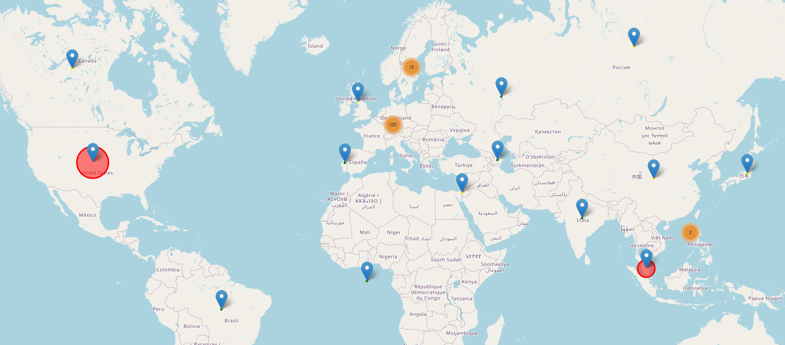
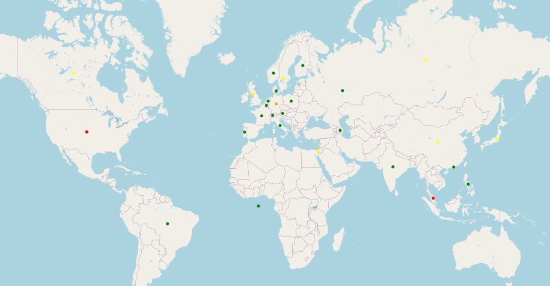

# PyPi Downloads Stats Visualization

This python script pulls data cve-bin-tool download stats from BigQuery public data table and add geo based visualization. 

There are two main components in this script
 * Get data from Google BigQuery public data set
 * Process and visualize the data using pandas, numpy, geopy and folium

 In order to pull data from BigQuery, you need to have Google credential. The BigQuery free service has limitation of how many data you can query per day. Given that said, an alternative method to read data from json file is provided to visualize the data if your free quota is reached. 

  Two visualization maps are generated, one is mainly used to show number of downloads  

The second one tries to use color to indicate the amount of downloads.

 There are certain limitations in the visualization, for one, it is not easy to display total number of downloads when there is no child clusters. 
