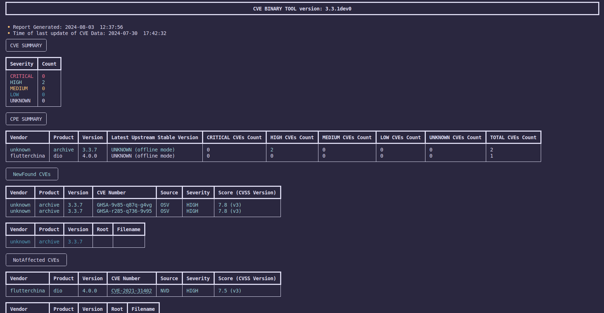
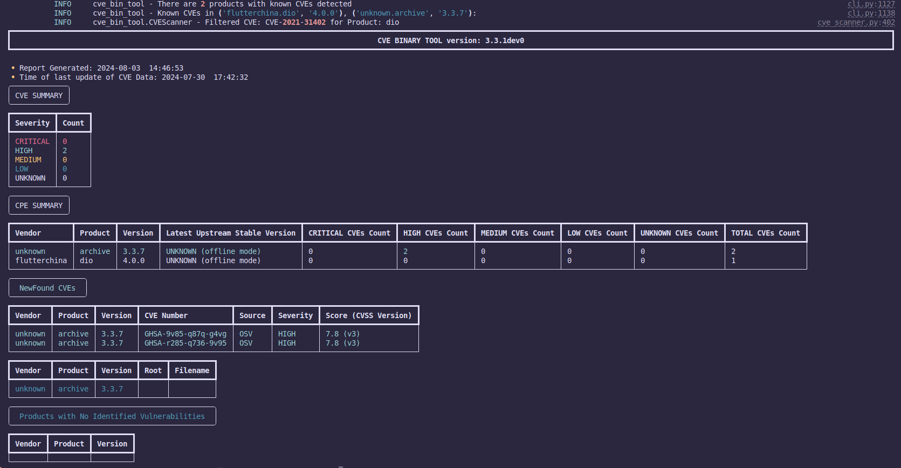

# Vulnerability Exploitability eXchange(VEX)

The CVE Binary Tool supports scanning VEX files and using them as triage files to filter out irrelevant vulnerabilities from the final report.

## Why Use VEX?
As the software world evolves, security attacks pose significant risks to modern software infrastructure. Software component transparency is crucial in addressing these risks, making Software Bill of Materials (SBOM) an essential tool. However, a new problem arises when sharing SBOMs across different teams and organizations. As part of the software lifecycle, security professionals often scan these SBOMs to identify potential vulnerabilities. Here's a short story to illustrate the issue:

Suppose CorporationX collaborates with CorporationY and exchanges software with them. CorporationY provides a firmware update to CorporationX and includes an SBOM with all the components of the firmware. Rishabh, a security professional at CorporationX, scans the SBOM and finds a reported vulnerability, CVE-2024-0803, in a component. He raises the issue with CorporationY, claiming they have shipped a vulnerable product.

To his surprise, CorporationY explains that they were already aware of the vulnerability. They clarify that the vulnerable component (Component A) is associated with a function (Function A) that is not being used in the software. Instead, they are using Function B, which is not associated with the reported vulnerability. Therefore, the component is not affected by the vulnerability.

This scenario can arise multiple times during the development and product shipment phases. With every iteration, it is inefficient for corporations to continually contact each other for clarification. A simple solution might seem to be creating a document that describes the vulnerabilities affecting the components and clarifies whether the component is impacted, along with necessary details and justifications. However, if the document is not machine-readable, Rishabh still has to scan the SBOM and manually triage the vulnerabilities using the shared document.

In this scenario, a VEX file would have provided the necessary context to indicate that the vulnerability in Component A does not affect the overall security of the product. CorporationY would ship a VEX document along with the SBOM, indicating that the vulnerability in Component A is marked as "Not Affected." The justification provided would be "Vulnerable_code_not_present," with detailed descriptions explaining why it is not affected.

Using tools like the CVE Binary Tool, Rishabh can scan both the SBOM and VEX files together. The CVE Binary Tool will generate a report with the irrelevant vulnerabilities filtered out, allowing Rishabh to focus on genuine threats. This improves the efficiency and accuracy of vulnerability management.

Using VEX files in conjunction with SBOMs ensures that only relevant vulnerabilities are flagged, reducing false positives and enhancing the overall security assessment process. While VEX is often used with SBOMs, it can also be utilized with other types of scans, such as binaries, language dependency files, and input files.

We will now take a look at how we can use VEX with the CVE Binary Tool.


## How to use VEX with Cve Binary Tool?

Cve Binary Tool supports following operation involving VEX files.

- Generating VEX document from Scan.
- Scanning VEX document as a Standalone File.
- Scanning VEX document as a Triage File for other files(SBOMs, Binaries and Dependency Management files).
- Generating an updated VEX from scan. 

### Supported Types of VEX :

| VEX Type  | Format   | Filename extension |
| --------- | -------- | ------------------ |
| CycloneDX | JSON     | .json              |
| CSAF      | JSON     | .json              |
| OpenVEX   | JSON     | .json              |


### Generating VEX document From Scan.

`cve-bin-tool` can be used to generate VEX documents from the scan being run using the tool. To generate VEX, the flags used are `--vex-type`, which tells the tool which type of VEX to generate (cyclonedx, openvex, and csaf), and `--vex-output` to define the filename of the output file. If `--vex-output` is not provided, a filename with the following convention is used: `product_release_vendor_vextype.json`.

Generating a new VEX document also requires you to define the name of the product being scanned, in addition to its release and vendor, using the flags `--vendor`, `--release`, and `--product`, respectively.

Let's see how to generate a `sample-cyclonedx-vex`.

```bash
cve-bin-tool --sbom cyclonedx --sbom-file sample-sbom.json --vex-type cyclonedx --vex-output sample-cyclonedx-vex.json --product myapp --vendor myappvendor --release 0.0.1 
```
a vex file with name sample-cyclonedx-vex.json in cyclonedx type will be generated.

Note: Always use `.json` extenstion with the name of vex output file to avoid facing errors.

### Scanning VEX document as a Standalone File

Individual vex file can be scanned using the flag provided `--vex-file`, cve-bin-tool automatically detects the vex type which is being scanned.

Example Usage:

We will use this `sample-vex.json` file throughout the usage demonstration.
```
{
  "$schema": "http://cyclonedx.org/schema/bom-1.6.schema.json",
  "bomFormat": "CycloneDX",
  "specVersion": "1.6",
  "serialNumber": "urn:uuid:cfa059b7-03cb-4297-a73b-d2c57860067e",
  "version": 1,
  "metadata": {
    "timestamp": "2024-07-31T10:38:40Z",
    "tools": {
      "components": [
        {
          "name": "lib4vex",
          "version": "0.1.0",
          "type": "application"
        }
      ]
    },
    "properties": [
      {
        "name": "Revision_1",
        "value": "Initial version"
      }
    ],
    "component": {
      "type": "application",
      "bom-ref": "CDXRef-DOCUMENT",
      "name": "myapp"
    }
  },
  "vulnerabilities": [
    {
      "bom-ref": "archive@3.3.7",
      "id": "GHSA-r285-q736-9v95",
      "description": "Filename spoofing in archive",
      "published": "2024-07-31T10:38:40Z",
      "updated": "2024-07-31T10:38:40Z",
      "analysis": {
        "state": "in_triage",
        "detail": ""
      },
      "affects": [
        {
          "ref": "urn:cbt:1/unknown#archive:3.3.7"
        }
      ]
    },
    {
      "bom-ref": "dio@4.0.0",
      "id": "CVE-2021-31402",
      "source": {
        "name": "NVD",
        "url": "https://nvd.nist.gov/vuln/detail/CVE-2021-31402"
      },
      "description": "The dio package 4.0.0 for Dart allows CRLF injection if the attacker controls the HTTP method string, a different vulnerability than CVE-2020-35669.",
      "published": "2024-07-31T10:38:40Z",
      "updated": "2024-07-31T10:38:40Z",
      "analysis": {
        "state": "not_affected",
        "detail": "Vulnerable function not present"
      },
      "affects": [
        {
          "ref": "urn:cbt:1/flutterchina#dio:4.0.0"
        }
      ]
    }
  ]
}
```

Now running the below command.

```bash
cve-bin-tool --vex-file sample-cyclonedx-vex.json
```
The output will look like the following: you can see that the `NotAffected` vulnerability is output in a separate field.




### Scanning VEX document as a Triage File

For using the VEX file as a triage file, the primary file being scanned (which can be one of many) could be passed with their respective flag or without a flag. Preferably, an SBOM is a companion to VEX (we will discuss this further below), but it is not limited to SBOMs for scanning.

For treating VEX as a triage file, we only require the `--vex-file` flag, and `cve-bin-tool` will automatically figure out that the VEX file being used is a companion file to other scan documents/files.

The `--vex-file` flag can be used with the `--filter-triage` flag. By default, `cve-bin-tool` does not filter out irrelevant entries. Here is where the `--filter-triage` flag comes into play. Using this will filter out the vulnerabilities marked as NotAffected or FalsePositive. By default, since vulnerabilities are not filtered out, they will be outputted in the same format as mentioned in the above image of the output with a standalone file.

Let's have a look at the use of the `--filter-triage` flag.

```bash
cve-bin-tool --filter-triage --sbom cyclonedx --sbom-file sample-sbom.json --vex-file sample-cyclonedx-vex.json
```
The output will look like the following. You can see that the `NotAffected` vulnerability is filtered out and a log message is displayed regarding it, and `CVE-2021-31402` related to the product: Dio is not reported in the output.



### Generating an updated VEX from scan.

Many times in the security auditing process, a new vulnerability may be introduced for a component present in the application. In these cases, the existing VEX documentation needs to be updated. We can run the following command in those situations:
```bash
cve-bin-tool --vex-file vex.json --vex-type cyclonedx --vex-output vex.json -rr "dio@4.0.0 is not affected" 
```
Here, the `cve-bin-tool` will automatically take product, vendor, and release information from the VEX file being scanned, so we aren't required to define those. One flag that is required is the `--revision-reason` or `-rr` flag, which specifies the reason for why the VEX document is being updated. Hence, if the `vex.json` already exists in the path, `cve-bin-tool` will update the `vex.json` file and generate a new `1_vex.json` file, also taking the revision reason into account. Below is the updated file demonstrating the same.

Note: Always pass value for `-rr` flag in double quotes

```
{
  "$schema": "http://cyclonedx.org/schema/bom-1.6.schema.json",
  "bomFormat": "CycloneDX",
  "specVersion": "1.6",
  "serialNumber": "urn:uuid:603cb3c5-0bfb-40d1-9db2-6c3f1a14015d",
  "version": 2,
  "metadata": {
    "timestamp": "2024-08-03T17:49:49Z",
    "tools": {
      "components": [
        {
          "name": "lib4vex",
          "version": "0.1.0",
          "type": "application"
        }
      ]
    },
    "properties": [
      {
        "name": "Revision_1",
        "value": "Initial version"
      },
      {
        "name": "Revision_2",
        "value": "dio@4.0.0 is not affected"
      }
    ],
    "component": {
      "type": "application",
      "bom-ref": "CDXRef-DOCUMENT",
      "name": "myapp"
    }
  },
  "vulnerabilities": [
    {
      "bom-ref": "archive@3.3.7",
      "id": "GHSA-r285-q736-9v95",
      "description": "Filename spoofing in archive",
      "published": "2024-08-03T17:49:49Z",
      "updated": "2024-08-03T17:49:49Z",
      "analysis": {
        "state": "in_triage",
        "detail": ""
      },
      "affects": [
        {
          "ref": "urn:cbt:1/unknown#archive:3.3.7"
        }
      ]
    },
    {
      "bom-ref": "dio@4.0.0",
      "id": "CVE-2021-31402",
      "source": {
        "name": "NVD",
        "url": "https://nvd.nist.gov/vuln/detail/CVE-2021-31402"
      },
      "description": "The dio package 4.0.0 for Dart allows CRLF injection if the attacker controls the HTTP method string, a different vulnerability than CVE-2020-35669.",
      "published": "2024-07-31T10:38:40Z",
      "updated": "2024-08-03T17:49:49Z",
      "analysis": {
        "state": "not_affected",
        "detail": "Vulnerable function not present"
      },
      "affects": [
        {
          "ref": "urn:cbt:1/flutterchina#dio:4.0.0",
          "versions": {
            "version": "4.0.0",
            "status": "unaffected"
          }
        }
      ]
    }
  ]
}
```
### Why We Use a `TRIAGE.json` File Inside the CVE Binary Tool Repository?

The CVE Binary Tool provides functionality to include scans as part of a GitHub continuous integration (CI) workflow using the [`cve-bin-tool-action`](https://github.com/intel/cve-bin-tool-action). This action is used to scan the repository for vulnerabilities, with the results displayed in the security tab of the scanned repository.

However, the generated report may sometimes include false positives. For example, CVE Binary Tool uses the Python arrow package, but the vulnerability report could mistakenly flag a vulnerability associated with Rust's arrow package, which shares the same name. Additionally, some detected vulnerabilities may not affect the repository being scanned; they might be mitigated, or the vulnerable function might not be used, as discussed earlier.

To address this, cve-bin-tool-action provides an option to filter out FalsePositive and NotAffected vulnerabilities using the vex_file option in the [`cve_bin_tool_action.yml`](https://github.com/intel/cve-bin-tool/blob/main/.github/workflows/cve_bin_tool_action.yml) configuration file, Such packages can be marked as NotAffected or FalsePositive in the TRIAGE.json file, which can then be used with cve-bin-tool-action to ensure that these entries are appropriately filtered out during the scanning process. reference: [`Issue #3193`](https://github.com/intel/cve-bin-tool/issues/3193)

### Limitations :

There are some limitations associated with product identification. We mainly use two types of product identification strings: Bom_ref and PackageURL (purl).

- Bom_ref is used to identify products in the CycloneDX format. We primarily support the bom_ref in this format: `urn:cbt:{bom_version}/{vendor}#{product}:{version}`.

- Purl is used to identify products in the OpenVEX and CSAF formats. The format is `pkg:generic/{vendor}/{product}@{version}`. Here, the type is set to generic by default. However, if a language dependency file is being scanned and the CVE Binary Tool can generate a valid purl from processing it, the type is set to the respective dependency management type (e.g., go, pypi, gem, npm, etc.), and the namespace field is used for vendor information.

- Cve Binary Tool will also ignore the entries for components which are from VEX document but are not present in the file/binary being scanned and log a message asking weather the VEX document being scanned belongs to the file/binary being scanned, example: `Product: dio with Version: 1.3.2 not found in Parsed Data, is valid vex file being used?`

This holy trio of vendor, product, and version/release allows the CVE Binary Tool to identify the component exactly and use it for the VEX process. Thus, it's no secret that the CVE Binary Tool works wonderfully with these. However, any VEX document generated outside the CVE Binary Tool may not be fully supported in the same way.

### Credits :
CVE Binary Tool heavily relies on many external open source libraries for its SBOM and VEX operations, so do check them out.

- [Lib4VEX](https://github.com/anthonyharrison/lib4vex)
- [Lib4SBOM](https://github.com/anthonyharrison/lib4sbom)
- [PackageURL-Python](https://github.com/package-url/packageurl-python)
